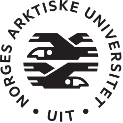

<!-- PROJECT LOGO -->
 

  

  <h3 align="center">Bachelor Projects</h3>

  

    A collection of code from adventurous assignments, projects, and courses during my B.sc.
  

<!-- TABLE OF CONTENTS -->

  
<h2 style="display: inline-block">Table of Contents</h2>

  <ol>
    <li>
      <a href="#about-the-project">About The Project</a>
      <ul>
        <li><a href="#contents">Contents</a></li>
        <li><a href="#tools-&-technologies">Tools & Technologies</a></li>
      </ul>
    </li>
    <li><a href="#license">License</a></li>
    <li><a href="#contact">Contact</a></li>
    <li><a href="#acknowledgements">Acknowledgements</a></li>
  </ol>

<!-- ABOUT THE PROJECT -->
## About The Project

This repository contains code produced as part of various adventurous assignments, projects and courses during my studies for a Bachelor's degree (B.Sc.) in computer Science at The University of Tromsø - The Arctic University (Uit). This repository is intended to serve as a reference for future projects, budding programmers, haters, employers and other curious people on how to (or how not to...) do various stuff in different languages.

Note that some code in this repository were provided as part of one or more assignments, or were made jointly with other students during collaborative projects.

### Contents

* [DTE2781 - Final Project, B.Sc.](DTE2781) - Final project for B.Sc. in Computer Science, C# and .Net Core 3.1
* [DTE2800 - Computer Graphics](DTE2800) - Introduction to shaders, 2D and 3D-graphics with WebGl and JavaScript
* [DTE2802 - Web Applications 2](DTE2802) - Advanced web apps course, using MVC, REST, C# and .Net Core 3.1
* [ITE1802 - Programming for Mobile Devices](ITE1802) - Programming applications for Android OS using Java
* [ITE1805 - Databases og Web Applications 1](ITE1805) - Introduction to databases and web applications with PHP and SQL
* [ITE1806 - Digital communication og Security](ITE1806) - Introduction to digital communication and security, Java
* [ITE1807 - Systems Engineering](ITE1807) - Systems engineering and project management, PHP and SQL
* [ITE1900 - Programming 1](ITE1900) - Introductory Java Programming
* [ITE1901 - Programming 2](ITE1901) - Advanced Java Programming
* [Misc.](misc) - Miscellaneous code not related to a particular subject

### Tools & Technologies
Incomplete list of tools, technologies and associated software used

* [JetBrains Suite (Student license)](https://www.jetbrains.com/)
* [MySQL Workbench](https://www.mysql.com/products/workbench/)
* [Java OpenJDK](https://openjdk.java.net/)
* [OpenJFX](https://openjfx.io/)
* [.Net Core 3.1](https://dotnet.microsoft.com/download/dotnet/3.1)
* [Android SDK](https://developer.android.com/studio/)
* [WebGL](https://get.webgl.org/)
* [Three.js](https://threejs.org/)
* [ammo.js](https://kripken.github.io/ammo.js/)
* [Flask](https://palletsprojects.com/p/flask/)

<!-- LICENSE -->
## License
Subject to change.  
Unless otherwise noted in an accompanying `LICENSE.txt`, `README.MD` or within the file itself, all code is distributed under the MIT License.  
See [`LICENSE.txt`](LICENSE.txt) for more information.

<!-- CONTACT -->
## Contact

Mail: [UnicronDev@outlook.com](mailto:UnicronDev@outlook.com)

Project Link: [https://github.com/Unicron2k/dte_bsc](https://github.com/Unicron2k/dte_bsc)

<!-- ACKNOWLEDGEMENTS -->
## Acknowledgements

* [Best-README-Template](https://github.com/othneildrew/Best-README-Template/)

Thank you to my fellow students for help and contributions!
